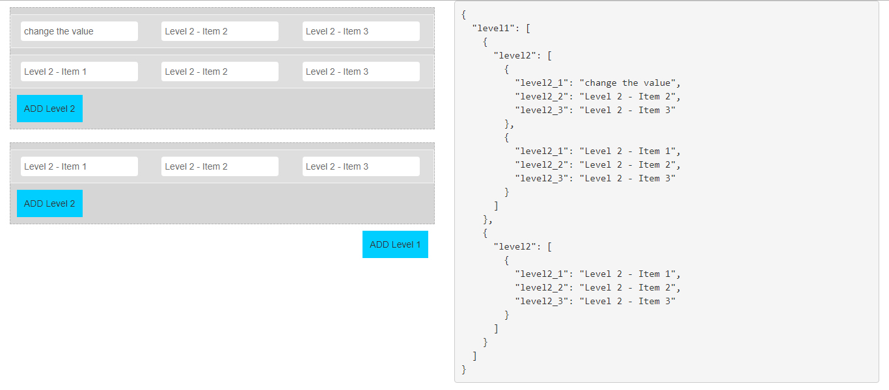

# Dynamic Form Element Generator (Array and Elements)
Multi Language App based on angular 6.




## Demo
You may want to have a look at the demo https://multilangapp.stackblitz.io

## Adding the component in your project
```
<app-select-lang></app-select-lang>
```

### Dependencies
```
npm install @ngx-translate/core --save 
npm install @ngx-translate/http-loader --save 
npm install jquery --save
npm install bootstrap@3 --save
```
### Services
```
The service call for transforming the language (common.service) and to get the data from assets/i18n (http-loader-factory.service)

1. servies/common.service.ts
2. services/http-loader-factory.service.ts
```

### assets/i18n
#### The section where you require to define the JSON data for your content properties. Each JSON file for each language.\
```
en.json 
ja.json 
fr.json 
ge.json 
```
### common.service.ts
``` typescript
import { TranslateService } from '@ngx-translate/core';

@Injectable({
  providedIn: 'root'
})
export class CommonService {
  selectedLang: string ='English';
  constructor(private translate: TranslateService) {
    translate.addLangs(['en', 'fr', 'ge', 'ja']);
    translate.setDefaultLang('en');

    let browserlang = translate.getBrowserLang();
    translate.use(browserlang.match(/en|fr|ge|ja/) ? browserlang: 'en');
   }

  setlang(lang){
    this.translate.use(lang);
    if(lang==='en'){
      this.selectedLang = 'English'
    } else if(lang=='fr') { 
      this.selectedLang = 'French'
    } else if(lang=='ge') { 
      this.selectedLang = 'German'
    } else {
      this.selectedLang = 'Japanese'
    }
  }
}
```

### select-lang.component.ts
``` typescript
import { Component, OnInit } from '@angular/core';
import { CommonService } from '../service/common.service';

@Component({
  selector: 'app-select-lang',
  templateUrl: './select-lang.component.html',
  styleUrls: ['./select-lang.component.css']
})
export class SelectLangComponent implements OnInit {
  private currentLang:string = '';
  constructor(private commonService: CommonService){
    this.currentLang = this.commonService.selectedLang
   }

  changeLanguage(lang){
   this.commonService.setlang(lang)
   this.currentLang = this.commonService.selectedLang
  }

  ngOnInit() {
  }
}

```

### select-lang.component.html
``` typescript
<header>
  <div class='row header'>
    <div class="col-sm-6"> 
      <nav class="navbar navbar-static-top custom_nav" role="navigation" style="margin-bottom: 0">   
        <div class="navbar-header">
          <a class="navbar-brand" href="#">
            <label>{{"header.Title" | translate}}</label>
          </a>
        </div>
        <ul class="nav navbar-top-links navbar-right">
          <li>Your Language: {{ currentLang }}</li>
          <li class="dropdown">
            <select name="language" id="" class="form-control" (change)="changeLanguage($event.target.value)">
              <option value="en">{{"common.lang.en" | translate}}</option>
              <option value="fr">{{"common.lang.fr" | translate}}</option>
              <option value="ge">{{"common.lang.ge" | translate}}</option>
              <option value="ja">{{"common.lang.ja" | translate}}</option>
            </select>
          </li>
        </ul>
      </nav>
    </div>
  </div>
</header>  
```
### ja.json
``` json

{
	"common": {
		"lang": {
			"en": "English",
			"fr": "français",
			"ge": "Deutsche",
			"ja": "日本人"
		}		
    },
    "header": {
		"Title":"マルチラングアプリ"		
	},
	"container": {
		"welocomeMsg": "アプリへようこそ",
		"username": "ユーザー名",
		"password": "パスワード",
		"bodyMsg": "このページでは、アプリのマルチ言語機能が強調表示され、データは送信されません"
	}
}
```
